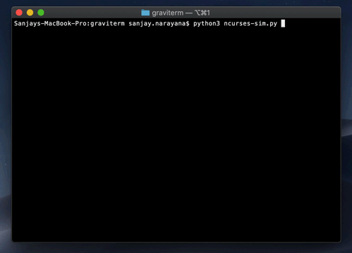

# graviterm

A two-body simulation in your terminal!

This project implements a two-body gravity simulation using some basic force equations.

```plain
              mi * mj
Fi =  Σ   ───────────────
     i≠j  |ri - rj + e|^2  

```

It works by iteratively calculating the position, velocity and acceleration of the bodies at every time-step.

```python
self._updateAcceleration()
self._updateVelocities()
self._updatePositions()
```

## Example

